<div align="center">

# 湖科电量 · HBUST Power

Native iOS and Android apps for checking your dorm's electricity balance at Hubei University of Science and Technology.

[简体中文](README.zh-CN.md) · English

[](#requirements)
[](#requirements)
[](#testing)

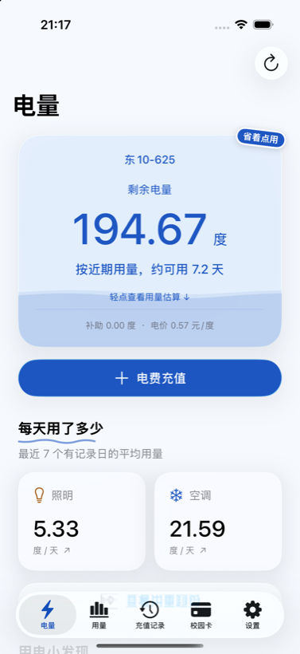
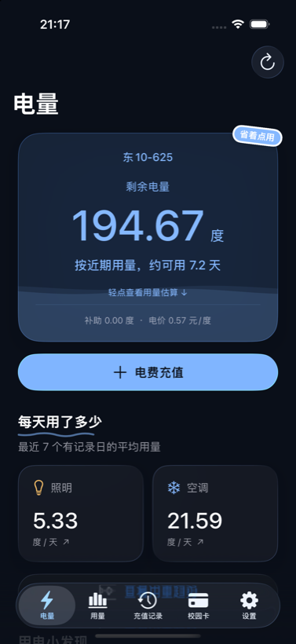
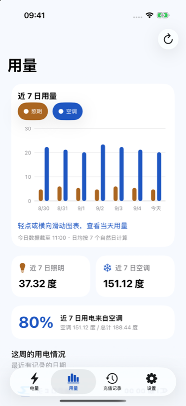

</div>

## Why this exists

The campus portal keeps the dorm electricity reading several taps deep. This app puts the two numbers that
matter — how much is left, and how long it will last — on the first screen.

Data comes straight from the school's own web services. There is no backend of mine in between, and the password
is never stored.

## Features

| | |
|---|---|
| Balance | Remaining kWh, estimated days left, subsidy and unit price |
| Usage | Seven-day chart split into lighting and air conditioning; tap or drag to read a single day |
| Recharges | History with a summary card, plus full details per record |
| Campus card | Balance read through the official card portal, multiple cards summed |
| Reminder | One local notification when the balance first falls below your threshold |
| Diagnostics | Notification and session state, refresh timings, and a redacted report you can copy |

A few extras beyond the basics:

- **Liquid balance card.** The card fills like a tank. Tilt the phone and the surface tilts with it; flick it
  sideways and the liquid follows your finger.
- **Pull to charge.** Pull past the threshold, let go, and a ring spins while the app fetches. Green checkmark on
  success, orange shake on failure.
- **Usage insights.** Swipeable cards: saved 12% this week, 3 days below average, AC used 81% of your power, your
  balance is worth about ¥57, last recharged 12 days ago.
- **Recharge planner.** Pick an amount to see how long it lasts, or pick a date to see what it costs. Splits the
  bill by roommate count and copies a line you can paste into a group chat.
- Doodled underlines, slightly crooked stickers, a paper note on the About page, and one easter egg.

### Themes

Three palettes in **Settings → Appearance**. Two are named after friends.

| Theme | Palette | Extra |
|---|---|---|
| 湖科蓝 | Cloud white and blue | The original look |
| 紫鸟紫 | Night violet and amber | A line from Tagore's *Stray Birds* on every launch |
| 枫烻黄 | Warm amber and collar red | A bell that swings when tapped |

Switching a theme repaints everything: cards, charts, the liquid, the sparks, and the widgets.

<div align="center">
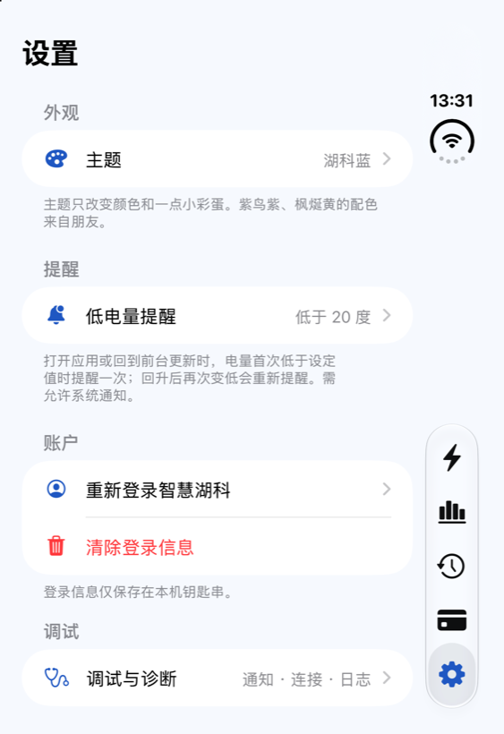
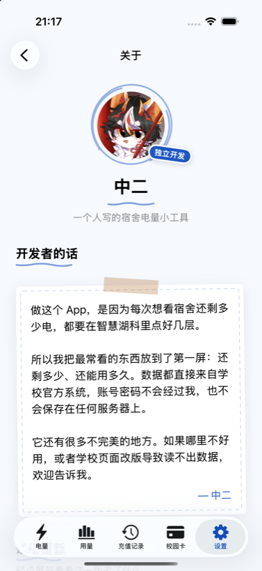
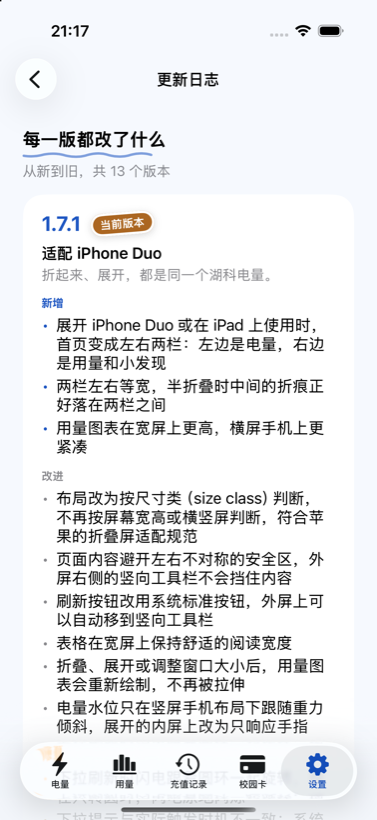
</div>

### Widgets

Small and medium home screen widgets, plus all three lock screen families. They follow the app's theme and turn
amber when the balance runs low.

<div align="center">
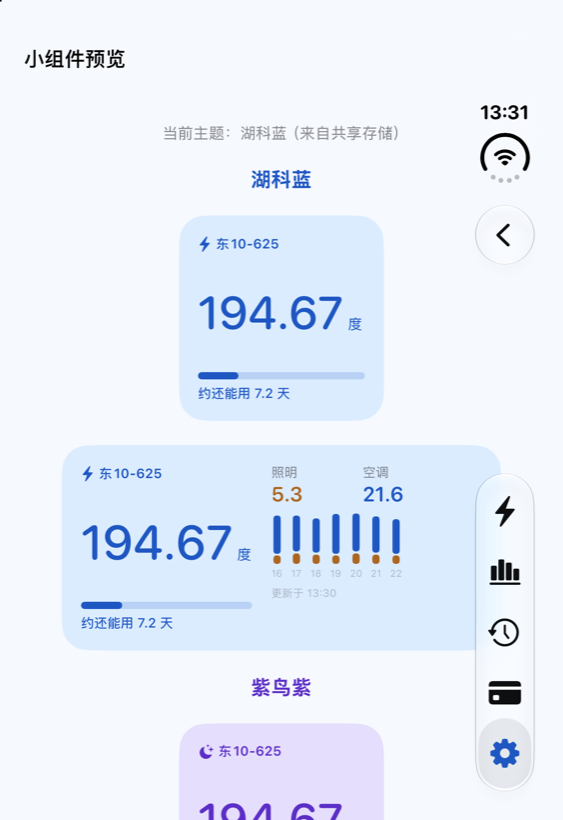
</div>

> Widgets read the app's data through an App Group (`group.com.local.hbustpower`), which needs a paid Apple
> Developer membership. Sideloading with a free Apple ID installs the extension but leaves it without shared
> storage, so it keeps showing the "open the app once" placeholder. **Settings → Diagnostics → Widgets** reports
> whether the shared container actually exists.

### Foldables and large screens

Layout decisions come from size classes, not from screen dimensions or orientation.

- Two even columns on an unfolded inner display and on iPad; one column on the outer display and on phones.
- When half folded, the gap between the columns is aligned to the hinge position reported by
  `reservedRegions(kind: .division)` (iOS 27.1+), so nothing interactive sits on the crease.
- Content respects asymmetric safe areas, so the vertical bar on the outer display never covers anything.
- Checked on the iPhone Duo simulator in four poses: outer, inner landscape, inner portrait, half folded.

<div align="center">
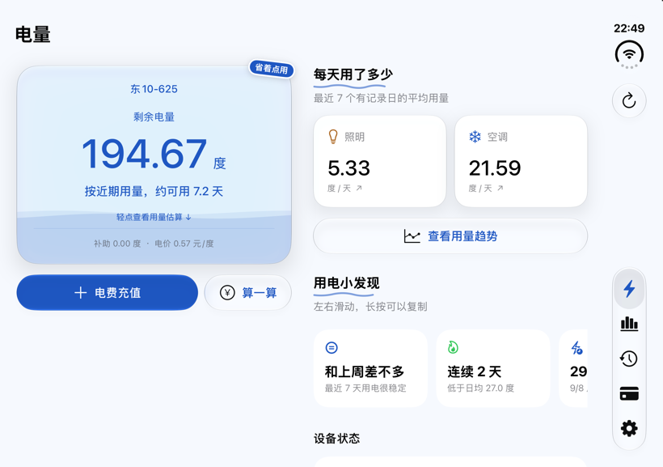
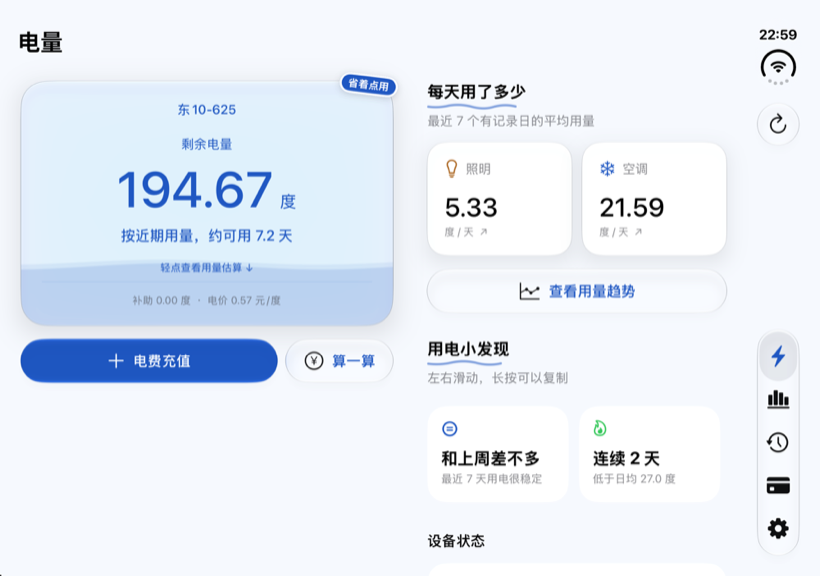
</div>

<details>
<summary>More screens</summary>

<div align="center">
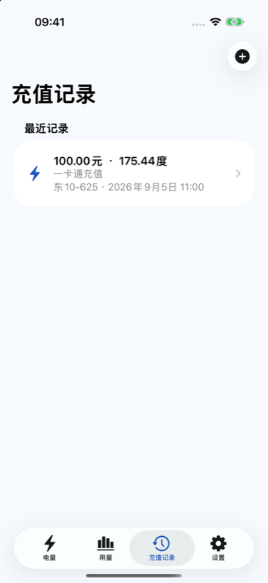
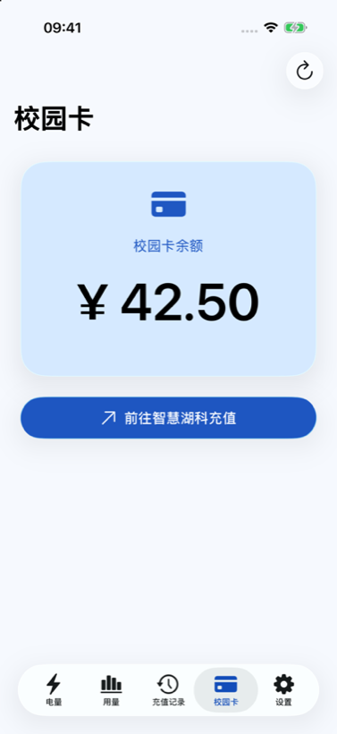
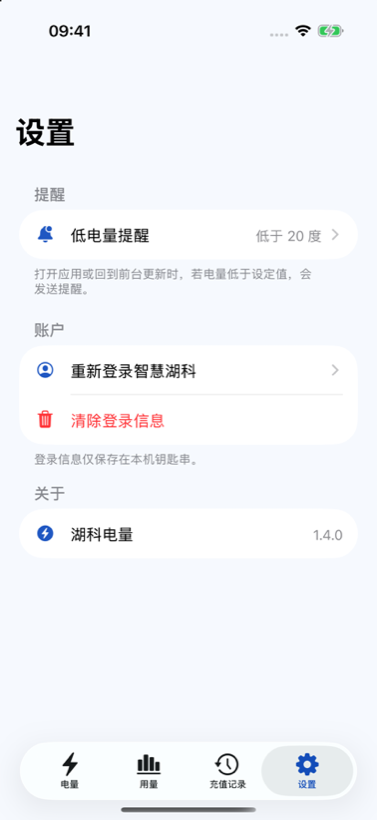
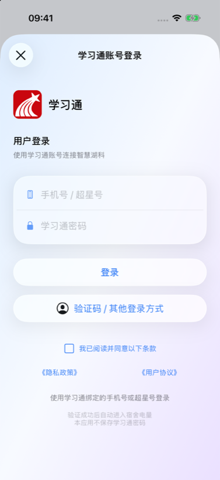
</div>

</details>

## Privacy

- Sign-in happens on the school's own Chaoxing page. The app fills the fields you typed and never saves the
  password.
- Only the authorization link is kept: iOS uses the Keychain and Android encrypts it with Android Keystore.
- No backend. Every request goes directly to the school.
- Diagnostics contain no account, dorm number, authorization URL or cookie values.
- Redirect URLs are checked strictly: exact host and path, exactly one `appId=180`, one non-empty token.

## Getting started

### iOS requirements

- Xcode 26 or newer (27.1+ for the iPhone Duo simulator)
- iOS 26 or newer
- A paid Apple Developer team if you want the widgets to show real data

### Build iOS

```sh
git clone https://github.com/zebwqfox/hbustpower.git
cd hbustpower/ios
open HBUSTPowerIOS.xcodeproj
```

Pick your team under Signing & Capabilities, select a device, and run.

### Build Android

Android requires SDK Platform 37, Build Tools 36+, and JDK 17–26. The minimum supported version is Android 6.

```powershell
cd android
.\gradlew.bat testDebugUnitTest assembleDebug lintDebug
```

The debug APK is written to `android/app/build/outputs/apk/debug/app-debug.apk`. See the [Android development guide](android/README.md) for details.

### Configure the school entry point

`ios/HBUSTPowerIOS/Services/ElectricityService.swift` holds the OAuth entry URL for the campus card service. The
`appKey` is redacted here:

```
appKey%3DREPLACE_WITH_YOUR_SCHOOL_APP_KEY
```

Get the current value from the official campus portal before building. The other parameters (`fidEnc`, `mappId`,
`wfwEnc`) are this school's configuration and will not work elsewhere.

### Unsigned IPA for sideloading

```sh
cd ios
./build_sideloadly_ipa.sh        # writes dist/湖科电量-iOS26-Sideloadly.ipa
```

Drop the IPA into [Sideloadly](https://sideloadly.io) and let it re-sign with your Apple ID. Leave
**Use automatic bundle ID** unchecked: it rewrites the app's bundle identifier, and the widget extension must stay
prefixed by it or iOS ignores the extension.

### Debug launch arguments

Debug builds accept flags that make the UI easy to inspect offline.

| Flag | Effect |
|---|---|
| `--ui-preview` | Offline demo data, no network |
| `--preview-tab=1…4` | Open Usage / Recharges / Campus card / Settings |
| `--preview-about`, `--preview-changelog`, `--preview-widgets` | Jump to those screens |
| `--slow-refresh-preview` | Delay the demo refresh by 3s to watch the charging animation |
| `--liquid-gravity-x=-0.5` | Fake gravity to check the liquid's tilt direction |
| `--simulate-vertical-bar` | Fake an asymmetric safe area, like the Duo outer display |

## Project layout

```
ios/
├─ HBUSTPowerIOS/
│  ├─ Models/           App state, snapshots, insights, recharge planner, changelog
│  ├─ Services/         Networking, HTML parsing, Keychain, notifications, diagnostics
│  ├─ ViewControllers/  Overview, Usage, Records, Campus card, Settings, About, Planner
│  └─ Views/            Theme, motion, charts, liquid, stickers, pull-to-charge
├─ HBUSTPowerWidgets/   WidgetKit extension
├─ Shared/              Code shared by app and widgets
├─ HBUSTPowerIOSTests/  Unit tests
└─ WidgetSupport/       Widget Info.plist and entitlements
android/                 Kotlin + Jetpack Compose Android client
fixtures/                Redacted HTML fixtures shared by both clients
filing/                  Privacy policy, user agreement, and filing materials
```

How data flows: a WebView completes the official sign-in, the app captures the electricity redirect, copies the
school cookies into its HTTP session, then fetches three pages and parses them. Parsing lives in
`ElectricityHTMLParser` with no networking in it, so it can be tested against fixtures.

## Testing

```sh
cd ios
xcodebuild test -project HBUSTPowerIOS.xcodeproj -scheme '湖科电量' \
  -destination 'platform=iOS Simulator,name=iPhone 17'
```

The iOS suite has 27 XCTest methods. Android has 44 JVM unit tests and passes Android Lint. Both clients cover
the fragile parts, including HTML parsing, redirect validation, usage estimates, recharge planning, and changelog
consistency.

## Roadmap

- [x] iOS app
- [x] Themes, widgets, recharge planner
- [x] iPhone Duo adaptation
- [x] Android client (Kotlin + Jetpack Compose), in `android/`
- [ ] Widgets verified on a device with a paid signing team

## Credits

- [@zebwqfox](https://github.com/zebwqfox) — author and maintainer
- Sign-in runs through the official Chaoxing and HBUST services; the Chaoxing logo only labels that sign-in path.
- The 紫鸟紫 and 枫烻黄 palettes are named after two friends.
- *Stray Birds* lines come from Tagore's 1916 collection in Zheng Zhenduo's 1922 translation, both public domain.
